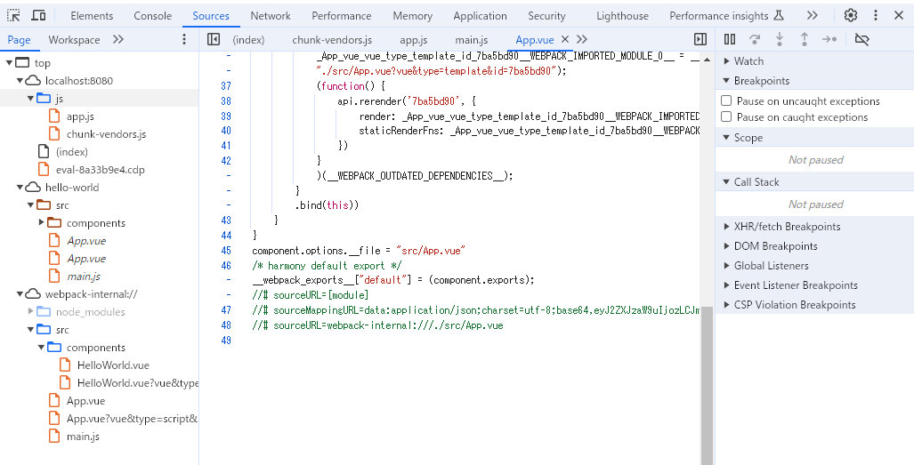

> https://cli.vuejs.org/
# vue CLI
## CLI
* @vue/cliはグローバルにインストールされたnpmパッケージでターミナルでvueコマンドを提供する
## CLI Service
* @vue/cli-serviceは開発依存
* package.jsonに記述されてそのnode_moduleにインストールされる
* webpackとwebpack-dev-serverの上に構築される
## CLIのインストール
```bash
npm install -g @vue/cli
```
## プロジェクトの作成
```bash
vue create <プロジェクト名>
```
## PluginsとPresets
### 既存のプロジェクトにプラグインをインストールする
```bash
vue add eslint
```
### Presets
* Vueプロジェクトを立ち上げる際に必要なオプションやプラグインを定義することでそのひな形を作ってくれるもの

## vue-cli-service server
* modeはデフォルトでdevelopment
## vue-cli-service build
* modeはデフォルトでproduction
* productionでbundleする際auto vendor chunk(自動でライブラリのまとまったJSファイルの作成)を実行する
## Caching and Parallelization
* cache-loaderはvue,babel,typescriptのコンパイルでデフォルトでnode_module/.cacheにキャッシュされる
* コンパイル時にエラーがあった場合.cacheを削除する
* thread-loaderは1つ以上のCPUコアがある場合にbabel/typescriptのトランスパイルで有効になる

# vue
## インストール
* vue devToolのインストール
> https://devtools.vuejs.org/guide/installation.html
## 用語
* コンパイラ: テンプレート文字列を JavaScript レンダリング関数にコンパイルするためのコードです。
* ランタイム: Vue インスタンスの作成やレンダリング、仮想 DOM の変更などのためのコードです。基本的にコンパイラを除く全てのものです。

# vsCodeでのDebug
```json
{
    "type": "chrome",
    "request": "launch",
    "name": "vuejs: chrome",
    "url": "http://localhost:8080",
    "webRoot": "${workspaceFolder}/src",
    "sourceMapPathOverrides": {
        "webpack:///src/*": "${webRoot}/*"
    }
}
```
* 上記でデバックができてエラーも出なかった
* 下記の画像のようになっている


## Reactとの比較
### 類似点
* 仮想DOMを使う
* ルーティングやグローバルの状態管理は他ライブラリに担当させる

### Vueのメリット
* Reactは関係ない子のコンポーネントを再描画しないようにPureComponent/ShouldComponentUpdateを使って最適化を行う
* vueは親子関係を意識せずに再描画のコンポーネントを正確認識する
    *
